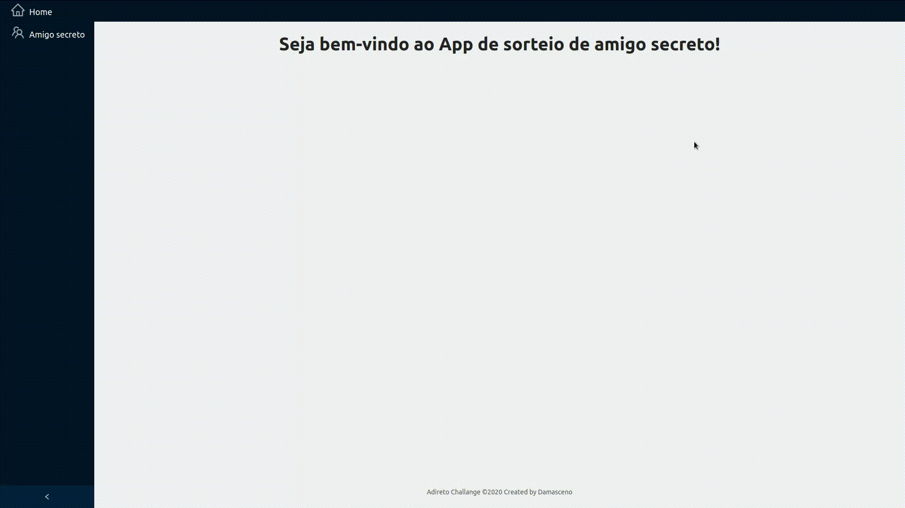

# ad-2019

Este é uma aplicação que realiza um sorteio de amigo secreto. A aplicação permite que você faça o cadastro da sua lista de Amigos
e selecione quais serão os participantes daquele amigo secreto. Assim que é feito toda a configuração ela sorteia cada participante
com seu respectivo amigo secreto e envia um email para cada um deles com as informações do seu amigo secreto sorteado.

Utilizou na sua implementação as seguintes tecnologias:

- Fronted: React
- API: Express + Mongoose + MongoDB
- Docker e Dockercompose

# How to run?

Dentro da pasta back-end, copie a file teste.env, renomeando a para .env e substituta os valores de username e password por um usuário valido.

- Caso tenha o docker-compose instalado na sua máquina utilize o comando:

\$ sudo docker-compose up -d --build

- Caso não tenha o docker-compose instalado você pode seguir este tutorial:

https://computingforgeeks.com/install-docker-and-docker-compose-on-linux-mint-19/

- Acesso:

http://localhost/

